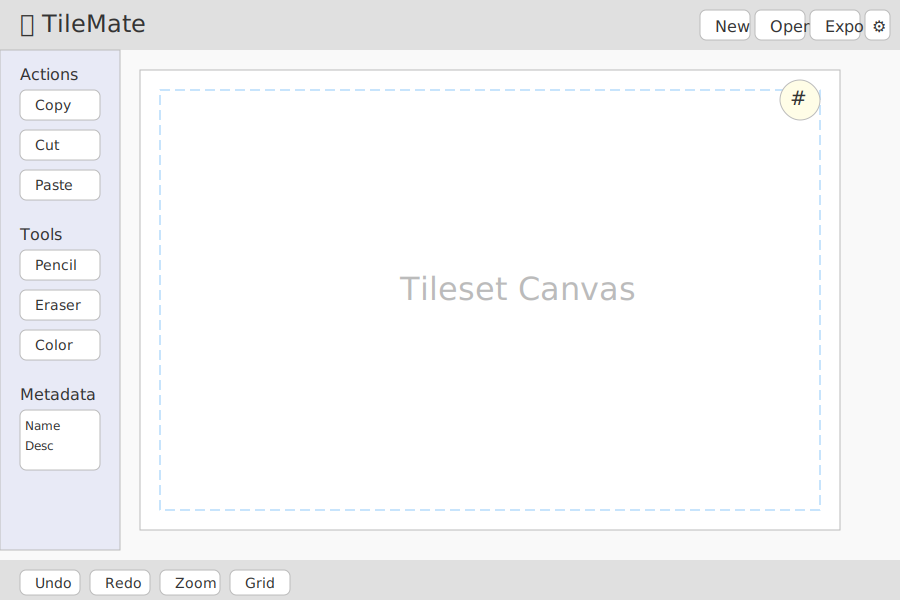
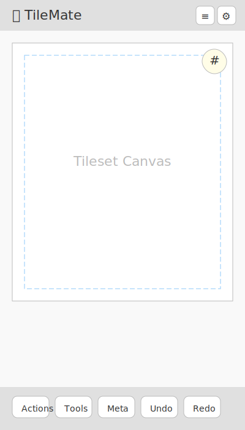

# 🧩 TileMate: Tileset Creation & Management Tool

## 🔄 Project Evolution
TileMate began as a simple idea to make tileset management accessible and intuitive for both hobbyists and professionals. The initial concept focused on basic tile selection and manipulation, but quickly expanded to include touch support, flexible grid configuration, and a vision for extensibility. Early on, the decision was made to prioritize a static, browser-based tool for maximum accessibility and ease of deployment.

## 🚀 Project Genesis & Motivation
The motivation for TileMate arose from the frustration of using heavyweight or overly complex tools for simple tileset tasks. The goal: empower users to load, create, and manage tilesets with minimal friction, directly in the browser, with a focus on usability and rapid iteration. Inspirations include classic pixel art editors and the desire to support both mouse and touch workflows.

## 📝 Project Overview
TileMate is a web-based tool for creating and managing tilesets. It supports loading standard image formats, configuring grid and tile sizes, and performing common tile operations (copy, cut, paste, move, etc.) with both mouse and touch input. Designed for game developers, artists, and educators, it aims to be the fastest way to get started with tileset management—no installation required.

## 💡 Core Ideas & Features
- Touch and mouse input support
- Load tileset images (PNG, JPEG)
- Create new blank tilesets
- Configure grid/tile size
- Toggleable grid lines overlay
- Highlight tiles on hover
- Select and manage tiles (copy, cut, paste, append, prepend, swap, move pixel-by-pixel)
- Static web app, deployable to GitHub Pages

## 🧩 Design Decisions & Rationale
- **Web-based, static app:** Chosen for accessibility and ease of deployment. No backend required.
- **PNG/JPEG support:** These are the most common and widely supported formats for tilesets. Other formats (GIF, WebP) may be considered later.
- **No built-in tile editing (v1.0):** Focus is on management, not pixel editing, to keep the tool lightweight and focused.
- **No hard performance limits:** Users are free to experiment; optimizations will be addressed as needed.
- **Pointer events:** Unified handling for mouse and touch simplifies code and UX.

## ❌ Rejected Ideas & Alternatives
- **Backend integration:** Dropped to keep the tool static and easy to host.
- **In-app tile drawing/editing:** Deferred to a future version to avoid scope creep.
- **Strict tileset size limits:** Not enforced; users will self-regulate based on performance.

## 🔮 Future requirements
- **Tile Metadata & Export:**
  - Add and edit descriptions, names, and tags for each tile.
  - Export tileset data and metadata in standard formats (e.g., Aseprite JSON) for use in game engines and other tools.
- **Multi-Tile Selection & Manipulation:**
  - Select multiple tiles at once (rectangle/lasso or shift+click).
  - Apply actions (copy, cut, paste, move, swap, etc.) to multiple tiles simultaneously.
  - Enhanced UI for managing and visualizing multi-tile selections.
- **In-app Tile Drawing/Editing:**
  - Draw, erase, and modify individual tiles directly within the app.
  - Provide basic pixel art editing tools (pencil, eraser, color picker, etc.).
  - Support undo/redo for tile edits.

These features will expand TileMate's capabilities for advanced workflows and integration with external tools.

## 💬 Key Conversation Excerpts
> "Support touch and mouse input. Load tileset image. Create new tilesets. Configure grid/tile size. Toggleable grid lines overlay. Highlight tiles on mouse over. Select tiles (and highlight selected). Manage selected tile: Copy, Cut, Paste, Append, Prepend, Swap, Move pixel by pixel."

> "For v1.0, support PNG and JPEG. Optionally, allow GIF and WebP if browser support is easy to add, but not required."

> "Just a static web site, no backend integration. Hosted on Github pages for now."

## 🏗️ Architecture & Structure
- **Frontend:** React (or plain TypeScript/JS), HTML5 Canvas for rendering and interaction. 
- **Alternative:** Phaser.js could also be used as a frontend/game framework for advanced rendering and interaction.
- **State Management:** React state or lightweight state library
- **File Handling:** FileReader API for image import/export
- **UI:** Canvas for tileset, toolbar/sidebar for actions, status bar for info

## 🎨 UI

### 🖥️ Desktop Wireframe



```
+-----------------------------------------------------------------------------------+
| 🧩 TileMate         [New] [Open] [Export] [Settings]                              |
+---------------------+-------------------------------------------------------------+
|  Sidebar            |                                                             |
|  [Tile Actions]     |                  Tileset Canvas                             |
|  [Drawing Tools]    |   +-----------------------------------------------+         |
|  [Tile Metadata]    |   |                                               |         |
|  (Collapsible)      |   |   [Grid Overlay]   [Tile Selection]           |         |
|                     |   |                                               |         |
|                     |   +-----------------------------------------------+         |
+---------------------+-------------------------------------------------------------+
| [Undo] [Redo] [Zoom] [Grid Toggle] (optional bottom bar or floating buttons)      |
+-----------------------------------------------------------------------------------+
```

- **Sidebar**: Always visible on the left, collapsible for more canvas space.
- **Top Bar**: Main actions, always accessible.
- **Canvas**: Centered, large, supports mouse and keyboard shortcuts.
- **Bottom Bar**: Quick actions (optional, can be floating).

### 📱 Mobile Wireframe



```
+------------------------------------------------------+
| 🧩 TileMate   [≡] [New] [Open] [Export] [Settings]   |
+------------------------------------------------------+
|                                                      |
|                Tileset Canvas                        |
|   +--------------------------------------------+     |
|   |                                            |     |
|   |   [Grid Overlay]   [Tile Selection]        |     |
|   |                                            |     |
|   +--------------------------------------------+     |
|                                                      |
+------------------------------------------------------+
| [Tile Actions] [Drawing Tools] [Metadata] (Drawer)   |
| [Undo] [Redo] [Zoom] [Grid] (Bottom bar, large btns) |
+------------------------------------------------------+
```

- **Sidebar**: Becomes a bottom drawer or floating action button for actions/tools.
- **Top Bar**: Compact, with hamburger menu for settings and file actions.
- **Canvas**: Fills most of the screen, supports pinch-to-zoom and pan.
- **Bottom Bar**: Large, touch-friendly quick actions.

## 💻 Code Snippets & Examples
*To be added as implementation progresses.*

## 📚 References & Inspirations
- Classic pixel art editors (Aseprite, Piskel)
- HTML5 Canvas API
- GitHub Pages for static hosting

## ❓ Open Questions & Next Steps
- Should GIF/WebP be supported in v1.0?
- What UI framework (React, plain JS, etc.) is preferred?
- Add wireframes and initial UI sketches
- Begin implementation of image loading and grid overlay

## 🔗 Full Conversation Reference
- See colocated `logs.json` for the full conversation history.
